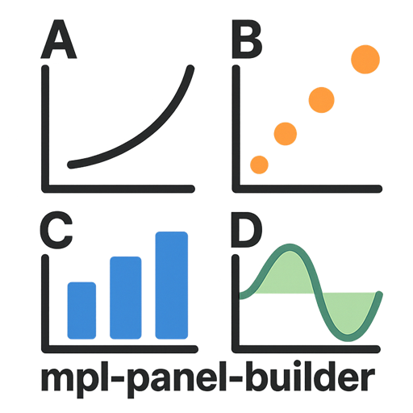
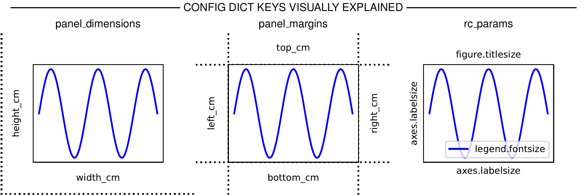

<p align="center">
       
</p>

<h2 align="center"> Create publication-quality scientific figure panels with a consistent layout</h2>

<div align="center">

[](https://github.com/NoviaIntSysGroup/mpl-panel-builder/actions/workflows/lint.yml)
[](https://github.com/NoviaIntSysGroup/mpl-panel-builder/actions/workflows/typecheck.yml)
[](https://github.com/NoviaIntSysGroup/mpl-panel-builder/actions/workflows/tests.yml)


[](https://badge.fury.io/py/mpl-panel-builder)


</div>

<div align="center">

`mpl-panel-builder` helps you compose matplotlib-based publication-quality scientific figure panels with precise and repeatable layouts. The shared precise layout lets you align panels perfectly into complete figures by simply stacking them vertically or horizontally. Included example scripts illustrate how to create panels and how these can be combined with TikZ to obtain a complete figure creation pipeline that is fully reproducible and under version control in Git. 

</div>

## Features

- 📏 **Precise Layout Control**: Define panel dimensions in centimeters for exact sizing
- 🎨 **Consistent Styling**: Maintain uniform fonts, margins, and aesthetics across panels
- 🔄 **Reproducible Workflow**: Version-controlled figure creation pipeline
- 📊 **Flexible Panel Composition**: Easy vertical and horizontal stacking of panels
- 🎯 **Publication-Ready**: Optimized for scientific publication requirements
- 🔧 **Extensible**: Simple class-based architecture for custom panel types

## Requirements

- Python 3.11 or higher
- Matplotlib
- TikZ (optional, for complete figure assembly)
- Poppler (optional, for converting PDFs to png)

## Installation

### From PyPI (recommended)

To use `mpl-panel-builder` in your project, install it from PyPI:

```bash
pip install mpl-panel-builder
```

### From source (for examples and development)

If you want to explore the examples or contribute to the project, follow these steps to install from source:

```bash
# clone repository
$ git clone https://github.com/NoviaIntSysGroup/mpl-panel-builder.git
$ cd mpl-panel-builder

# install package and development dependencies
$ uv sync
```

## Basic usage

Panels are created by subclassing `PanelBuilder`, and by defining their size and margins. Font sizes and styles can be adjusted via rcParams. A minimal example is given below:

```python
from mpl_panel_builder.panel_builder import PanelBuilder

# 1. Define the configuration
config = {
    # Panel dimensions
    "panel_dimensions": {
        "width_cm": 6.0,
        "height_cm": 5.0,
    },
    # Margins around the panel content (axes)
    "panel_margins": {
        "top_cm": 0.5,
        "bottom_cm": 1.5,
        "left_cm": 1.5,
        "right_cm": 0.5,
    },
    # Styling via rcParams
    "style": {
        "rc_params": {
            "font.size": 8,
        }
    }
}

# 2. Subclass PanelBuilder
class MyPanel(PanelBuilder):
    # Required class attributes
    _panel_name = "my_panel"  # Unique identifier for the panel
    _n_rows = 1               # Number of rows in the panel grid
    _n_cols = 1               # Number of columns in the panel grid

    def build_panel(self) -> None:
        """Populate the panel with your content.
        
        This method is called automatically when calling the panel class instance.
        Override this method to define your custom plotting logic.
        """
        # Access the single axis
        ax = self.axs[0][0]

        # Add your plotting code here
        ax.plot([1, 2, 3], [1, 2, 3])
        ax.set_xlabel("X axis")
        ax.set_ylabel("Y axis")

# 3. Create and build the panel
panel = MyPanel(config)
fig = panel()  # This creates and returns the figure panel
```

### Configuration Documentation

To explore all available configuration options, use the built-in documentation feature that provides a hierarchical overview of all configuration options, including required and optional fields with their descriptions, types, and default values.

```python
from mpl_panel_builder.panel_config import PanelConfig

# Display all configuration keys with descriptions
print(PanelConfig.describe_config())
```

### Configuration Templates

You can also generate a template YAML config file to get started:

```python
from mpl_panel_builder.panel_config import PanelConfig

# Generate a complete template with all options
PanelConfig.save_template_config("my_config.yaml")
```

and then use it after editing:

```python
import yaml

with open("my_config.yaml") as f:
    config_dict = yaml.safe_load(f)["panel_config"]
    
config = PanelConfig.from_dict(config_dict)
```

## Examples

The repository includes example scripts that demonstrate both panel creation and how to programmatically assemble panels into complete figures using additional tools (TikZ and Poppler). All generated files are stored under `outputs/`.

### Example 1: Minimal example

```bash
# Create panels only
uv run python examples/ex_1_minimal_example/create_panels.py
```

### Example 2: Config key visualization

```bash
# Create panels only
uv run python examples/ex_2_config_visualization/create_panels.py
# Create complete figure, requires TikZ and Poppler
uv run python examples/ex_2_config_visualization/create_figure.py
```

  

## Repository layout

```
├── src/mpl_panel_builder/    # Library code
├── examples/                 # Demo scripts and LaTeX templates
├── outputs/                  # Generated content
├── tests/                    # Test suite
```

## Development

Install development requirements and set up the hooks:

```bash
uv sync
uv run pre-commit install --hook-type pre-commit --hook-type pre-push
```

Before committing or pushing run:

```bash
uv run ruff check .
uv run pyright
uv run pytest
```

## Contributing

We welcome contributions! Please follow these steps:

1. Fork the repository
2. Create a feature branch (`git checkout -b feature/amazing-feature`)
3. Make your changes
4. Run the test suite (`uv run pytest`)
5. Commit your changes (`git commit -m 'Add amazing feature'`)
6. Push to the branch (`git push origin feature/amazing-feature`)
7. Open a Pull Request

Please ensure your code follows our style guidelines:
- Use Ruff for code formatting and linting
- Use Pyright for type checking
- Follow Google's Python style guide for docstrings
- Include type annotations for all functions
- Add tests for new functionality

## License

This project is released under the [MIT License](LICENSE).
